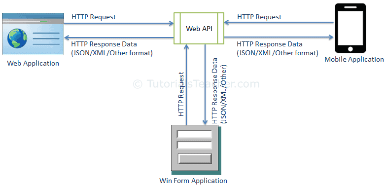
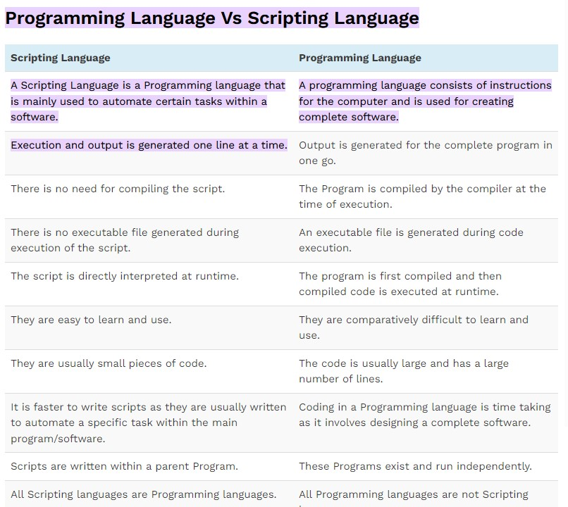
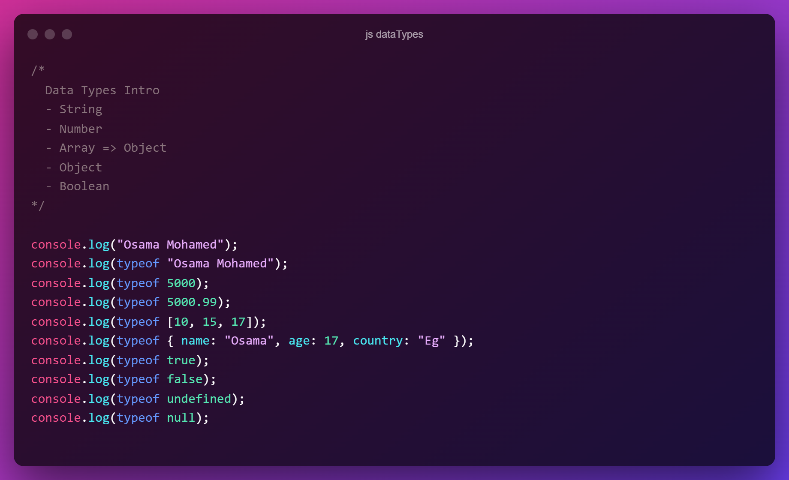
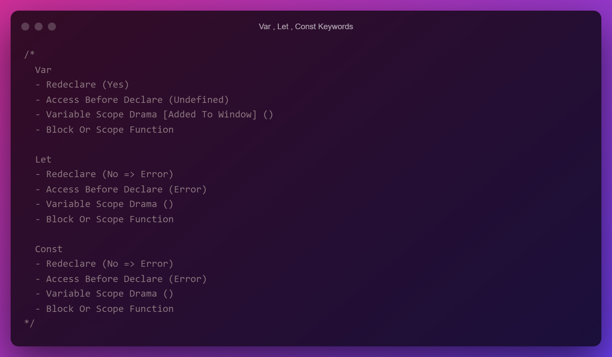
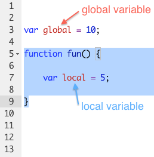

# Web API

API is some kind of interface which has a set of functions that allow programmers to access specific features or data of an application, operating system or other services .Web API as the name suggests, is an API over the web which can be accessed using HTTP protocol.
 
_WebAPI -It is a concept and not a technology._
 
We can build Web API using different technologies such as Java, .NET etc.. 

## JavaScript Console

an object which provides access to the browser debugging console.
_Console : web api_

## ECMAScript

Ecma :

## Scripting vs Programming Language

## Data Types in JS

!

## Var, Let, Const keywords Compare

## Losaly Typed VS Strongly Typed Language

https://flaviocopes.com/loosely-strongly-typed/

## typeof NAN

==> Number
 
_it is a numeric data type whose value cannot be represented using actual numbers._

## isNAN function

<h3>
console.log (Number.isNaN(100)); // false  
console.log (Number.isNaN("Abu khaled")); //false  
console.log (Number.isNaN("Abu khaled" / 120)); //true
</h3>

## Strings Methods

- Access With Index
- Access With charAt()
- length
- trim()
- toUpperCase()
- toLowerCase()
- Chain Methods
- indexOf(Value [Mand], Start [Opt] 0)
- lastIndexOf(Value [Mand], Start [Opt] Length)
- slice(Start [Mand], End [Opt] Not Include End)
- repeat(Times) [ES6]
- split(Separator [Opt], Limit [Opt])
  - substring(Start [Mand], End [Opt] Not Including End)
    -- Start > End Will Swap
    -- Start < 0 It Start From 0
    -- Use Length To Get Last Character
- substr(Start [Mand], Characters To Extract)
  -- Start >= Length = ""
  -- Negative Start From End
- includes(Value [Mand], Start [Opt] Default 0) [ES6]
- startsWith(Value [Mand], Start [Opt] Default 0) [ES6]
- endsWith(Value [Mand], Length [Opt] Default Full Length) [ES6]

## Nullish

Logical Or ||
-- Null + Undefined + Any Falsy Value  
_console.log(`The Price Is ${price || 200}`);_
 
Nullish Coalescing Operator ?? 
-- Null + Undefined  
_console.log(`The Price Is ${price ?? 200}`);_

## Arrays Methods [Adding And Removing]

- unshift("", "") Add Element To The First
- push("", "") Add Element To The End
- shift() Remove First Element From Array
- pop() Remove Last Element From Array

## Arrays Methods [Search]

- indexOf(Search Element, From Index [Opt])
- lastIndexOf(Search Element, From Index [Opt])
- includes(valueToFind, fromIndex [Opt]) [ES7]

## Arrays Methods [Sort]

- sort(Function [Opt])
- reverse

## Arrays Methods [Slicing]

- slice(Start [Opt], End [Opt] Not Including End)
  -- slice() => All Array
  -- If Start Is Undefined => 0
  -- Negative Count From End
  -- If End Is Undefined || > Indexes => Slice To The End Array.length
  -- Return New Array
- splice(Start [Mand], DeleteCount [Opt] [0 No Remove], The Items To Add [Opt])
  -- If Negative => Start From The End

## Arrays Methods [Joining]

- concat(array, array) => Return A New Array
- join(Separator)
   
   

# Notes :)

## Function Default Parameters Is undefined

 

## Scope - Global And Local

“Scope” is just a technical term for the parts of your code that have access to a variable.
 
Variables defined outside a function are […] called global variables.
 
Variables defined within a function are local variables.
 
_See The Below Photo For Explain It : )_
 

## Execution Context

## Lexical Environment

## Higher Order Functions

---> is a function that accepts functions as parameters and/or returns a function.
can accept Anounmes Functions or Functions

## - Map

--- method creates a new array
--- populated with the results of calling a provided function on every element
--- in the calling array.

Syntax map(callBackFunction(Element, Index, Array) { }, thisArg)

- Element => The current element being processed in the array. [Manditory]
- Index => The index of the current element being processed in the array. [Optional]
- Array => The Current Array . [Optional]

# Notes :)

- Map Return A New Array

## - Filter

--- method creates a new array with all elements that pass the test implemented by the provided function.

Syntax filter(callBackFunction(Element, Index, Array) { }, thisArg)

## Reduce

--- method executes a reducer function on each element of the array,

#### resulting in a single output value.

Syntax
reduce(callBackFunc(Accumulator, Current Val, Current Index, Source Array) { }, initialValue)

- Accumulator => the accumulated value previously returned in the last invocation
- Current Val => The current element being processed in the array
- Index => The index of the current element being processed in the array.
  ---------- Starts from index 0 if an initialValue is provided.
  ---------- Otherwise, it starts from index 1.
- Array => The Current Array

## Object

- What Is Object  
  object is a standalone entity, with properties and type
- Accessing Object  
  - A) Dot Notation  
  - B) Bracket Notation
- Dynamic Property Name
 
==> Example of Object and Nested Object
 
<pre>
<code>
  let user = {
  name: "Osama",
  age: 38,
  skills: ["HTML", "CSS", "JS"],
  available: false,
  addresses: {
  ksa: "Riyadh",
  egypt: {
  one: "Cairo",
  two: "Giza",
  },
  },
  checkAv: function () {
  if (this.available === true) {
  return `Free For Work`;
  } else {
  return `Not Free`;
  }
  },
  };

console.log(user.name);
console.log(user.age);
console.log(user.skills);
console.log(user.skills.join(" | "));
console.log(user.skills[2]); // Access With Index
console.log(user.addresses.ksa);
console.log(user.addresses.egypt.one);
console.log(user["addresses"].egypt.one);
console.log(user["addresses"]["egypt"]);
console.log(user["addresses"]["egypt"]["one"]);

console.log(user.checkAv());
</code></pre>

## How To Create An Object !!

### solu: )

### Create Object Directly

<pre><code>
let user = {
  name:"ahmed"
  sayHello:function (){
    return `Hello ${this.name}`;
  }
}
</code></pre>

### Create Object With New Keyword

<pre><code>
let user = new Object({
  age: 20,
});
</code></pre>

### Creat Object With Creat Method :

proto - The object which should be the prototype of the newly-created object

<pre><code>
let obj = Object.create({});
let copyObj = Object.create(user);
</code></pre>

### Create Object With Assign Method

<pre><code>
let finalObject = Object.assign(targetObject, obj1, obj2);
let newObject = Object.assign({}, obj1, { prop5: 5, prop6: 6 });
</code></pre>

## Object Delete Operator

#### Note:) Delete Opreator Not Allowed For Delete Objects, It Can Delete Property Just .

<pre><code>
const user = { name: "Osama" };

console.log(user);
console.log(user.name);

// delete user.name;
// delete user["name"];
console.log(delete user["name"]);

console.log(user);
console.log(user.name);

console.log("#".repeat(15));

const username = "Osama";
console.log(username);
console.log(delete username);
console.log(username);

console.log("#".repeat(15));

/*
The Object.freeze() method freezes an object. Freezing an object prevents extensions and makes existing properties non-writable and non-configurable. A frozen object can no longer be changed: new properties cannot be added, existing properties cannot be removed, their enumerability, configurability, writability, or value cannot be changed, and the object's prototype cannot be re-assigned. freeze() returns the same object that was passed in.
*/

const freezedObj = Object.freeze({ age: 37 });
console.log(freezedObj);
console.log(freezedObj.age);

console.log(delete freezedObj.age);

console.log(freezedObj);
console.log(freezedObj.age);

console.log("#".repeat(15));

const eObj = {};
Object.defineProperty(eObj, "a", { value: 1, configurable: false });
console.log(eObj);
console.log(eObj.a);

console.log(delete eObj.a);

console.log(eObj);
console.log(eObj.a);

function deepFreeze(object) {
  // Retrieve the property names defined on object
  const propNames = Object.getOwnPropertyNames(object);

  // Freeze properties before freezing self

  for (const name of propNames) {
    const value = object[name];
    if (value && typeof value === "object") {
      deepFreeze(value);
    }
  }

  return Object.freeze(object);
}

const obj2 = {
  internal: {
    a: "mainValue",
  },
};

deepFreeze(obj2);

obj2.internal.a = "anotherValue"; // fails silently in non-strict mode

console.log(obj2.internal.a);

</code></pre>

## this Keyword

When a function is called as a method of an object, its this is set to the object the method is called on.

- Global Context ===> (this = Window)
- Function Context ===> (this = Function)

  In an object method, this refers to the object.  
  Alone, this refers to the global object. 
  In a function, this refers to the global object. 
  In a function, in strict mode, this is undefined. 
  In an event, this refers to the element that received the event. 
  Methods like call(), apply(), and bind() can refer this to any object.

# Notes :)

- this is not a variable. It is a keyword. You cannot change the value of this.
- Default value of this is : undefined

- ## Strict Mode

Strict Mode was introduced in ECMAScript 5 that allows you to place a program, or a function, in a “strict” operating context. This strict context prevents certain actions from being taken and throws more exceptions.

 
Strict mode makes several changes to normal JavaScript semantics.
  

- First, strict mode eliminates some JavaScript silent errors by changing them to throw errors.

- Second, strict mode fixes mistakes that make it difficult for JavaScript engines to perform optimizations: strict mode code can sometimes be made to run faster than identical code that’s not strict mode.
- Third, strict mode prohibits some syntax likely to be defined in future versions of ECMAScript.
  Strict mode code and non-strict mode code can coexist in a same script.

Basically it helps you make fewer errors, by detecting things that could lead to breakage which are not detected normally (non-strict mode)

_It is highly preferred, as you will be able to write a proper code that is compatible with the standards and eliminate from your life the Bad Syntax and problems that disrupt the engine of the language and follow the proper standards for the new features that will appear in the language_

## Object.keys(yourObject)

Returns the names of the enumerable string properties and methods of an object.

## Object.values(yourObject)

Returns an array of values of the enumerable properties of an object

## Object.hasOwnProperty(Property)

Returns true if the object has the specified property as own property; false otherwise.

## Sort An Object

<pre>
<code>
"use strict";
let object = {
  name: "wesam",
  age: 20,
  ageOsama: 38,
};
console.log(Object.keys(object).sort());
</code>
</pre>

<pre>
<code>
console.log(Object.keys(myFavGames));
console.log(Object.values(myFavGames));
</code>
</pre>

<pre>
<code>
"use strict";
let myFavGames = {
  "Trinity Universe": {
    publisher: "NIS America",
    price: 40,
  },
  "Titan Quest": {
    publisher: "THQ",
    bestThree: {
      one: "Immortal Throne",
      two: "Ragnarök",
      three: "Atlantis",
    },
    price: 50,
  },
  YS: {
    publisher: "Falcom",
    bestThree: {
      one: "Oath in Felghana",
      two: "Ark Of Napishtim",
      three: "origin",
    },
    price: 40,
  },
};
let objectLength = Object.keys(myFavGames).length;
// console.log();

for (let i = 0; i < objectLength; i++) {
  console.log(`The Game Name Is ${Object.keys(myFavGames)[i]}`);
  console.log(`The Publisher Is ${Object.values(myFavGames)[i].publisher}`);
  console.log(`The Price Is ${Object.values(myFavGames)[i].price}`);

  // Check If Nested Object Has Property (bestThree)
  if (myFavGames[Object.keys(myFavGames)[i]].hasOwnProperty("bestThree")) {
    console.log("- Game Has Releases");
    console.log(`First => ${Object.values(myFavGames)[i].bestThree.one}`);
    console.log(`Second => ${Object.values(myFavGames)[i].bestThree.two}`);
    console.log(`Third => ${Object.values(myFavGames)[i].bestThree.three}`);
  }
  console.log("#".repeat(20));
}
</code>
</pre>

### For In Loop With Object Properties

<pre>
<code>
const user = {
  name: "Osama",
  country: "Egypt",
  age: 37,
};

let finalData = "";

for (let info in user) {
  console.log(`The ${info} Is => ${user[info]}`);
  finalData += `
The ${info} Is => ${user[info]}
`;
}

console.log(finalData);
</code>
</pre>

## DOM

- What Is DOM ==> (Document Object Model)  
  The Document Object Model (DOM) is a programming API for HTML and XML documents. It defines the logical structure of documents and the way a document is accessed and manipulated.

In the DOM specification, the term "document" is used in the broad sense - increasingly, XML is being used as a way of representing many different kinds of information that may be stored in diverse systems, and much of this would traditionally be seen as data rather than as documents. Nevertheless, XML presents this data as documents, and the DOM may be used to manage this data.

With the Document Object Model, programmers can create and build documents, navigate their structure, and add, modify, or delete elements and content. Anything found in an HTML or XML document can be accessed, changed, deleted, or added using the Document Object Model, with a few exceptions - in particular, the DOM interfaces for the internal subset and external subset have not yet been specified.

As a W3C specification, one important objective for the Document Object Model is to provide a standard programming interface that can be used in a wide variety of environments and applications. The Document Object Model can be used with any programming language.

- DOM Selectors  
  --- Find Element By ID  
  --- Find Element By Tag Name  
  --- Find Element By Class Name  
  --- Find Element By CSS Selectors  
  --- Find Element By Collection  
  ------ title  
  ------ body  
  ------ images  
  ------ forms  
  ------ links  

In the Document Object Model, documents have a logical structure which is very much like a tree; to be more precise, it is like a "forest" or "grove" which can contain more than one tree. However, the Document Object Model does not specify that documents be implemented as a tree or a grove , nor does it specify how the relationships among objects be implemented in any way. In other words, the object model specifies the logical model for the programming interface, and this logical model may be implemented in any way that a particular implementation finds convenient.<mark> In this specification, we use the term structure model to describe the tree-like representation of a document</mark>; we specifically avoid terms like "tree" or "grove" in order to avoid implying a particular implementation. One important property of DOM structure models is <mark>structural isomorphism</mark>: if any two Document Object Model implementations are used to create a representation of the same document, they will create the same structure model, with precisely the same objects and relationships.

## Limitations of Level One

The DOM Level 1 specification is intentionally limited to those methods needed to represent and manipulate document structure and content. Future Levels of the DOM specification will provide:

- A structure model for the internal subset and the external subset.
- Validation against a schema.
- Control for rendering documents via stylesheets.
- Access control.
- Thread-safety.

## Element.setAttribute()

Sets the value of an attribute on the specified element. If the attribute already exists, the value is updated; otherwise a new attribute is added with the specified name and value.

To get the current value of an attribute, use getAttribute(); to remove an attribute, call removeAttribute().

### Syntax

<pre><code>setAttribute(attrname, value)</code></pre>

### Parameters

- ### name

  A string specifying the name of the attribute whose value is to be set. The attribute name is automatically converted to all lower-case when setAttribute() is called on an HTML element in an HTML document.

- ### value
  A string containing the value to assign to the attribute. Any non-string value specified is converted automatically into a string.

Boolean attributes are considered to be true if they're present on the element at all. You should set value to the empty string ("") or the attribute's name, with no leading or trailing whitespace. See the example below for a practical demonstration.

Since the specified value gets converted into a string, specifying null doesn't necessarily do what you expect. Instead of removing the attribute or setting its value to be null, it instead sets the attribute's value to the string "null". If you wish to remove an attribute, call removeAttribute().

### Return value

None (undefined)

### <a href="https://www.w3schools.com/jsref/tryit.asp?filename=tryjsref_node_textcontent_innerhtml_innertext"><mark>TheDifferences Between innerText, innerHTML and textContent</mark></a>

### DOM [Check Attributes]

- Element.attributes
- Element.hasAttribute
- Element.hasAttributes
- Element.removeAttribute

### DOM (CreateElement)

- createElement
- createComment
- createTextNode
- createAttribute
- appendChild

<pre>
<code>
let myElement = document.createElement("div");
let myAttr = document.createAttribute("data-custom");
let myText = document.createTextNode("This is A Text");
let myComment = document.createComment("This Is Div");

myElement.className = "product";
myElement.setAttributeNode(myAttr);
myElement.setAttribute("data-test", "Testing");

myElement.appendChild(myComment);
myElement.appendChild(myText);
document.body.appendChild(myElement);
</code>
</pre>

### DOM (Deal With Childrens)

- children
- childNodes
- firstChild
- lastChild
- firstElementChild
- lastElementChild

### Class List Object And Methods

The Element.classList is a read-only property that returns a live DOMTokenList.   DOMTokenList collection of the class attributes of the element. This can then be used to manipulate the class list.  
Using classList is a convenient alternative to accessing an element's list of classes as a space-delimited string via element.className
 
Although the classList property itself is read-only, you can modify its associated DOMTokenList using the add(), remove(), replace(), and toggle() methods.
 

toggle as add and remove at same time, if class existing remove else adding
 

<pre>
<code>
let element = document.getElementById("my-div");

console.log(element.classList); /* all class */
console.log(typeof element.classList); /* Object */
console.log(element.classList.contains("osama")); /* false */
console.log(element.classList.contains("show")); /* true */
console.log(element.classList.item("3")); /* one */

element.onclick = function () {
  element.classList.toggle("show");
};
</code>
</pre>

### DOM [Traversing]

- nextSibling
- previousSibling
- nextElementSibling
- previousElementSibling
- parentElement

### BOM [Browser Object Model]

The Browser Object Model (BOM) in JavaScript includes the properties and methods for JavaScript to interact with the web browser.
BOM provides you with a window objects, for example, to show the width and height of the window. It also includes the window.screen object to show the width and height of the screen.

- Window Object Is The Browser Window
- Window Contain The Document Object
- All Global Variables And Objects And Functions Are Members Of Window Object
   
  ==> You Need To Know It's Exist Just <==
   

- alert(Message) => Need No Response Only Ok Available
- confirm(Message) => Need Response And Return A Boolean
- prompt(Message, Default Message) => Collect Data

  #### So Important Topic

- setTimeout(Function, Timeout, Additional Params) // ==> Timeout in milliseconds
- clearTimeout(handler) // ==> method to prevent the function from starting

The setTimeout() is executed only once.

### location Object

- href Get / Set [URL || Hash || File || Mail]
- host
- hash
- protocol
- reload()
- replace()
- assign()

### window.open and widnow.close

window.open("url","blank or self open","witdt,height","features");
 
window.close();

### Local Storage

The Storage interface of the Web Storage API provides access to a particular domain's session or local storage. It allows, for example, the addition, modification, or deletion of stored data items.
 
To manipulate, for instance, the session storage for a domain, a call to Window.sessionStorage is made; whereas for local storage the call is made to Window.localStorage.

#### Properties

- Storage.key()
- Storage.setItem
- Storage.getItem()
- Storage.removeItem()
- Storage.clear()

Info

- No Expiration Time
- HTTP And HTTPS has diffrent local storage
- Private Tab has diffrent local storage

.jpg>)
.jpg>)

### javascript asynchronous programming

<a href="https://youtu.be/Kpn2ajSa92c">YouTub Link For Simplified The Concept</a>

### Limitation of localStorage

- localStorage is synchronous .
- localStorage is limited 5MB just .
- localStorage is not protected, can accessed by any code on webpage .

### Destructuring

is a JavaScript expression that allows us to extract data from arrays,
objects, and maps and set them into new, distinct variables.

Read it for understand the topic :
<a href="https://www.freecodecamp.org/news/array-destructuring-in-es6-30e398f21d10/" title='Good Article From FreeCodeCamp' target="_blank">
A brief introduction to array destructuring in ES6</a>

### Set Data Type

Syntax: new Set(Iterable)  
-- Object To Store Unique Values  
-- Cannot Access Elements By Index  

Properties:

- size

Methods:

- add
- delete
- clear
- has

### Set vs WeakSet

The WeakSet is weak, meaning references to objects in a WeakSet are held weakly. If no other references to an object stored in the WeakSet exist, those objects can be garbage collected.

 
Set => Can Store Any unique Data Values 
WeakSet => Collection Of unique Objects Only 
-- 
Set => Have Size Property 
WeakSet => Does Not Have Size Property 
-- 
Set => Have Keys, Values, Entries 
WeakSet => Does Not Have clear, Keys, Values And Entries 
-- 
Set => Can Use forEach 
WeakSet => Cannot Use forEach 
 
Usage: Store objects and removes them once they become inaccessible

In WeakSet that there is no list of current objects stored in the collection.<u> WeakSets are not enumerable</u>

### Map Data Type

Map vs Object
 
------ Map => Does Not Contain Key By Default  
------ Object => Has Default Keys  
--
 
How To Make Object Without Default Key ?
 

<pre><code>
let myEmptyObject = Object.create(null); // object with no default key
</code></pre>

##  

  

--
 
------ Map => Key Can Be Anything [Function, Object, Any Primitive Data Types]  
------ Object => String Or Symbol  

<pre><code>
let myNewMap = new Map();
myNewMap.set(10, "Number");
myNewMap.set("10", "String");
myNewMap.set(true, "Boolean");
myNewMap.set({a: 1, b: 2}, "Object");
myNewMap.set(function doSomething() {}, "Function");
</code></pre>

 

-- 
------ Map => Ordered By Insertion 
------ Object => Not 100% Till Now 
-- 

-- 
------ Map => Get Items By Size  
------ Object => Need To Do Manually 
-- 

-- 
------ Map => Can Be Directly Iterated 
------ Object => Not Directly And Need To Use Object.keys() And So On 
-- 
------ Map => Better Performance When Add Or Remove Data 
------ Object => Low Performance When Comparing To Map 

## Map Methods

<pre>
<code>
/*
  - Map Data Type
  Methods
  --- set
  --- get
  --- delete
  --- clear
  --- has

  Properties
  --- size
*/

let myMap = new Map([
  [10, "Number"],
  ["Name", "String"],
  [false, "Boolean"],
]);

// myMap.set(10, "Number");
// myMap.set("Name", "String");

console.log(myMap);

console.log(myMap.get(10));
console.log(myMap.get("Name"));
console.log(myMap.get(false));

console.log("####");

console.log(myMap.has("Name"));

console.log("####");

console.log(myMap.size);

console.log(myMap.delete("Name"));

console.log(myMap.size);

myMap.clear();

console.log(myMap.size);
</code>
</pre>

## Map VS WeakMap

<pre>
<code>
/*
  - Map vs WeakMap
  "
    WeakMap Allows Garbage Collector To Do Its Task But Not Map.
  "
  --
  Map     => Key Can Be Anything
  WeakMap => Key Can Be Object Only
  --
*/

let mapUser = { theName: "Elzero" };

let myMap = new Map();

myMap.set(mapUser, "Object Value");

mapUser = null; // Override The Reference

console.log(myMap);

console.log("#".repeat(20));

let wMapUser = { theName: "Elzero" };

let myWeakMap = new WeakMap();

myWeakMap.set(wMapUser, "Object Value");

wMapUser = null; // Override The Reference

console.log(myWeakMap);
</code>
</pre>

### Array.from() Method

Array.from(Iterable , MapFunction , This);
  
<a src="https://www.programiz.com/javascript/library/array/from" title="https://www.programiz.com/javascript/library/array/from" target="_blank">Javascript Array.from()</a>

### Array.copyWithin()

- Array.copyWithin(Target, Start => Optional, End => Optional)  
  "Copy Part Of An Array To Another Location in The Same Array" 
  -- Any Negative Value Will Count From The End 
  -- Target 
  ---- Index To Copy Part To 
  ---- If At Or Greater Than Array Length Nothing Will Be Copied 
  -- Start 
  ---- Index To Start Copying From 
  ---- If Ommited = Start From Index 0 
  -- End 
  ---- Index To End Copying From 
  ---- Not Including End 
  ---- If Ommited = Reach The End 

<pre><code>
let myArray = [10, 20, 30, 40, 50, "A", "B"];

// myArray.copyWithin(3); // [10, 20, 30, 10, 20, 30, 40]

// myArray.copyWithin(4, 6); // [10, 20, 30, 40, "B", "A", "B"]

// myArray.copyWithin(4, -1); // [10, 20, 30, 40, "B", "A", "B"]

// myArray.copyWithin(1, -2); // [10, "A", "B", 40, 50, "A", "B"]

myArray.copyWithin(1, -2, -1); // [10, "A", 30, 40, 50, "A", "B"]

console.log(myArray);
</code></pre>

### Array.some()

Method to test if an array has at least one element that meets a condition 

Array.some(CallbackFunc(Element, Index, Array),This) 
------ Element => The Current Element To Process 
------ Index => Index Of Current Element 
------ Array => The Current Array Working With 
--- This Argument => Value To Use As This When Executing CallbackFunc 

##### Caution: Empty arrays

If you call the some() method on an empty array, the result is always false regardless of any condition.

### Array.every()

For test whether every element of an array satisfies a specified condition 

- Array.every(CallbackFunc(Element, Index, Array), This Argument) 
  ------ Element => The Current Element To Process 
  ------ Index => Index Of Current Element 
  ------ Array => The Current Array Working With 
  --- This Argument => Value To Use As This When Executing CallbackFunc 

### Spread Syntax And Use Cases

<pre><code>
/*
  Spread Operator => ...Iterable
  "Allow Iterable To Expand In Place"
*/

// Spread With String => Expand String

console.log("Osama");
console.log(..."Osama");
console.log([..."Osama"]);

// Concatenate Arrays

let myArray1 = [1, 2, 3];
let myArray2 = [4, 5, 6];

let allArrays = [...myArray1, ...myArray2];
console.log(allArrays);

// Copy Array

let copiedArray = [...myArray1];
console.log(copiedArray);

// Push Inside Array

let allFriends = ["Osama", "Ahmed", "Sayed"];
let thisYearFriends = ["Sameh", "Mahmoud"];

allFriends.push(...thisYearFriends);

console.log(allFriends);

// Use With Math Object

let myNums = [10, 20, -100, 100, 1000, 500];
console.log(Math.max(...myNums));

// Spread With Objects => Merge Objects

let objOne = {
  a: 1,
  b: 2,
};
let objTwo = {
  c: 3,
  d: 4,
};

console.log({ ...objOne, ...objTwo, e: 5 });
</code></pre>

### Regular Expression

patterns used to match character combinations in strings
In JavaScript, regular expressions are also objects

#### Syntax

/pattern/modifier(s);  
new RegExp("pattern", "modifier(s)")  

#### Modifiers => [Flags]

i => case-insensitive  
g => global  
m => Multilines  

#### Search Methods

- match(Pattern)
   
  Match 
  -- Matches A String Against a Regular Expression Pattern 
  -- Returns An Array With The Matches 
  -- Returns null If No Match Is Found. 
   
- Test Method 
  pattern.test(input) 

### Regular Expression character Classes

#### Regular expressions are particularly useful for defining filters. Regular expressions contain a series of characters that define a pattern of text to be matched to make a filter more specialized, or general.

<pre>
<code>
/*
  character Classes 
  . => matches any character, except newline or other line terminators.
  \w => matches word characters. [a-z, A-Z, 0-9 And Underscore] = [a-zA-Z0–9_]
  \W => matches Non word characters = Any Special Characters and Species .
  \b => matches at the beginning or end of a word.
  \B => matches NOT at the beginning/end of a word.
  \d => matches digits from 0 to 9.
  \D => matches non-digit characters.
  \s => matches whitespace character.
  \S => matches non whitespace character.
*/

let email = 'O@@@g...com O@g.com O@g.net A@Y.com O-g.com o@s.org 1@1.com';
let dot = /./g;
let word = /\w/g;

let valid = /\w@\w.(com|net)/g;
console.log(email.match(dot));
console.log(email.match(word));
console.log(email.match(valid));

let names = "Sayed 1Spam 2Spam 3Spam Spam4 Spam5 Osama Ahmed Aspamo";
let re = /(\bspam|spam\b)/ig;
console.log(names.match(re));

console.log(re.test(names));
console.log(/(\bspam|spam\b)/ig.test("Osama")); // flase
console.log(/(\bspam|spam\b)/ig.test("1Spam")); // true
console.log(/(\bspam|spam\b)/ig.test("Spam1")); // true

</code>
</pre>

### Quantifiers

n+ => One Or More  
n\* => zero or more 
n? => zero or one 

<pre><code>
let mails = "o@nn.sa osama@gmail.com elzero@gmail.net osama@mail.ru"; // All Emails
// let mailsRe = /\w+@\w+.(com|net)/ig;
let mailsRe = /\w+@\w+.\w+/ig;
console.log(mails.match(mailsRe));

let nums = "0110 10 150 05120 0560 350 00"; // 0 Numbers Or No 0
let numsRe = /0\d*0/ig;
console.log(nums.match(numsRe));

let urls = "https://google.com http://www.website.net web.com"; // http + https
let urlsRe = /(https?:\/\/)?(www.)?\w+.\w+/ig;
console.log(urls.match(urlsRe));

/*
  Quantifiers
  n{x}   => Number of
  n{x,y} => Range
  n{x,}  => At Least x
*/

let serials = "S100S S3000S S50000S S950000S";

console.log(serials.match(/s\d{3}s/ig)); // S[Three Number]S
console.log(serials.match(/s\d{4,5}s/ig)); // S[Four Or Five Number]S
console.log(serials.match(/s\d{4,}s/ig)); // S[At Least Four]S
</code></pre>

<pre><code>
/*
  Quantifiers
  $  => End With Something
  ^  => Start With Something
  ?= => Followed By Something
  ?! => Not Followed By Something
*/

let myString = "We Love Programming";
let names = "1OsamaZ 2AhmedZ 3Mohammed 4MoustafaZ 5GamalZ";

console.log(/ing$/ig.test(myString));
console.log(/^we/ig.test(myString));
console.log(/lz$/ig.test(names));
console.log(/^\d/ig.test(names));

console.log(names.match(/\d\w{5}(?=Z)/ig));
console.log(names.match(/\d\w{8}(?!Z)/ig));
</code></pre>

# Commonly Useful used RegEx patterns

<pre>
# Password strength validation
We generally estimate the strength of a Password based on the numerics, symbols, and Uppercase alphabets used in it. The following regular expression checks if the string contains one lowercase alphabet, one uppercase alphabet, one number, and a symbol.
<code>(?=.*\d)(?=.*[a-z])(?=.*[A-Z])(?!.*\s)(?=.*[!@#$*])</code>

## Email
<code>^[a-zA-Z0–9+_.-]+@[a-zA-Z0–9.-]+$</code>

### URL
<code>/https?:\/\/(www\.)?[-a-zA-Z0–9@:%._\+~#=]{2,256}\.[a-z]{2,6}\b([-a-zA-Z0–9@:%_\+.~#()?&//=]*)/</code>

#### Html Tags
<code>/<\/?[\w\s]*>|<.+[\W]>/gi;</code>

##### Empty string
<code>/^\s*$/</code>
</pre>
 

# Prototype => \_\_proto\_\_

<pre>
<code>
/*
  Prototype
  [1] Every Object Has A Prototype
  [2] Prototype Chain Ends With Object.prototype
  [2] In Javascript Function Is Object
*/

function User(name) {
  /*
    [1] Create Empty Object
    [2] Assign The New Object To this Context
    [3] New Object Created Prototype = Function Prototype
    this = {};
    this.__proto__ = User.__proto__
  */
  this.name = name;
  /*
    [4] Return The New Object
    return this
  */

  // if (!(this instanceof User)) {
  //   // throw new Error("Must Be Called With New Keyword");
  //   console.log("Error");
  // }

  // ES6
  if (!new.target) {
    throw new Error("Must Be Called With New Keyword");
    console.log("Error");
  }
}

let user1 = new User("Osama");
let user2 = new User("Ahmed");
console.log(User.prototype);
console.log(user1);

let myArray = [1, 2, 3, 4];

/*
  Importants Notes And The End
  [1] Arrow Functions Do Not Have a Prototype Property.
  [2] You Can Use Objects Inside Constructor Freely
  [3] f = function () {} ==== f() {}
*/

class User {
constructor(fName, lName, age, email) {
this.name = {
first: fName,
last: lName,
};
this.age = age;
this.email = email;
}
sayHello = function () {
return `Say Hello`;
};
sayHi() {
return `Say Hi`;
}
}

let user1 = new User("Osama", "Elzero", 37, "o@nn.sa");
console.log(user1.name.first);
console.log(user1.name.last);
console.log(user1.age);
console.log(user1.email);
console.log(user1.sayHello());
console.log(user1.sayHi());
</code>
</pre>

### Notes:) Arrow Functions Do Not Have a Prototype Property.

## ==============================================================

# Date And Time

### Epoch Time Or Unix Time In Computer Science Is The Number of Seconds Since January 1, 1970

### getDate

<pre>
new Date(); ==> constructor give you full time with day,hours,minuts,seconds ,millseconds , Eastern European Summer Time . ex: Wed May 01 2002 00:00:00 GMT+0300 (Eastern European Summer Time)
Date.now() ==> Time In MillSeconds From "Jan 1, 70"
new Date().getTime() ==> Time In MillSeconds From "Jan 1, 70"
new Date().getDate() ==>  Day From Month
new Date().getDay() ==>  Day From Week
new Date().getMonth()==>  Month Number 'Zero Based'
new Date().getHours() ==> get Current Hour 
new Date().getMinuts() ==> get Current Minuts 
new Date().getSeconds() ==> get Current Seconds 
new Date().getFullYear() ==> get Current Years //> Used It In Footer To Update CopyRight Automatically.
</pre>

### setDate

<pre>
setTime(Milliseconds)
setDate() => Day Of The Month [Negative And Positive]
setFullYear(year, month => Optional [0-11], day => Optional [1-31])
setMonth(Month [0-11], Day => Optional [1-31]) [Negative And Positive]
setHours(Hours [0-23], Minutes => Optional [0-59], Seconds => Optional [0-59], MS => Optional [0-999])
setMinutes(Minutes [0-59], Seconds => Optional [0-59], MS => Optional [0-999])
setSeconds(Seconds => [0-59], MS => Optional [0-999])
</pre>

### DateFormat

<pre>
new Date(timestamp)
new Date(Date String)
new Date(Numeric Values)

- "Oct 25 1982"
"10/25/1982"
"1982-10-25" => ISO International Standard
"1982 10"
"1982"
"82"
1982, 9, 25, 2, 10, 0
1982, 9, 25

"1982-10-25T06:10:00Z" ==> Mon Oct 25 1982 08:10:00 GMT+0200 (Eastern European Standard Time)
T: As Spreateor >
0Z :Time Zone
</pre>

<pre>
<code>
let dateNow = new Date();
let birthday = new Date("Oct 25, 82");
let dateDiff = dateNow - birthday;

console.log(dateDiff);
console.log(dateDiff / 1000 / 60 / 60 / 24 / 365);

console.log(dateNow);
console.log(dateNow.getTime());
console.log(dateNow.getDate());
console.log(dateNow.getFullYear());
console.log(dateNow.getMonth());
console.log(dateNow.getDay());
console.log(dateNow.getHours());
console.log(dateNow.getMinutes());
console.log(dateNow.getSeconds());

/*
  Date And Time
  - setTime(Milliseconds)
  - setDate() => Day Of The Month [Negative And Positive]
  - setFullYear(year, month => Optional [0-11], day => Optional [1-31])
  - setMonth(Month [0-11], Day => Optional [1-31]) [Negative And Positive]
  - setHours(Hours [0-23], Minutes => Optional [0-59], Seconds => Optional [0-59], MS => Optional [0-999])
  - setMinutes(Minutes [0-59], Seconds => Optional [0-59], MS => Optional [0-999])
  - setSeconds(Seconds => [0-59], MS => Optional [0-999])
*/

let dateNow = new Date();
console.log(dateNow);

console.log("#".repeat(66));

// dateNow.setTime(0);
// console.log(dateNow);

// console.log("#".repeat(66));

// dateNow.setTime(10000);
// console.log(dateNow);

// console.log("#".repeat(66));

// dateNow.setDate(35);
// console.log(dateNow);

// dateNow.setFullYear(2020, 13);
// console.log(dateNow);

dateNow.setMonth(15);
console.log(dateNow);
</code>
</pre>

# Generators

## <mark>Allow you to define an iterative algorithm by writing a single function whose execution is not continuous.</mark>

- Generator Function Run Its Code When Required.
- Generator Function Return Special Object [Generator Object]
- Generators Are Iterable

### Instance methods :)

- Generator.prototype.next() 
- Generator.prototype.return() 
- Generator.prototype.throw() 
  Returns a value yielded by the yield expression.

### Show Examples To Understand It:

<pre><code>

// [Example 1] 
function* generatorToltip() {
  yield "awsome toltip";
  yield "awsome toltip";
  yield "awsome toltip";
}

const generator = generatorToltip();

console.log(generator);

console.log(generatorToltip().next().value);
console.log(generatorToltip().next().value);
console.log(generatorToltip().next().value);
console.log(generatorToltip().next().done);

for (let value of generator) {
  console.log(value);
  console.log("هي دي ");
}

The Diffrence Here IS : When You Call Main Genrator Function The Yield Done, When Use Varible Yield Just One
for (let value of generatorToltip()) {
  console.log(value);
}
 
// [Example 2] Anthor Example

function\* infinite() {
let index = 0;
while (true) {
yield index++;
}
}
const generator = infinite();
console.log(generator.next().value);
console.log(generator.next().value);
console.log(generator.next().value);
console.log(generator.next().value);
console.log(generator.next().value);
console.log(generator.next().value);
console.log(generator.next().value);
console.log(generator.next().value);
console.log(generator.next().value);
console.log(generator.next().value);
console.log(generator.next().value);
console.log(generator.next().value);
console.log(generator.next().value);
console.log(generator.next().value);
console.log(generator.next().value);
console.log(generator.next().value);
console.log(generator.next().value);
console.log(generator.next().value);
console.log(generator.next().value);
console.log(generator.next().value);
console.log(generator.next().value);
console.log(
generator.return(
"::End:: After Return No Any Thing Yield In Generator Function "
).value
);
console.log(generator.next().value);
console.log(generator.next().value);
</code></pre>

# Delegate Generator Function

## <mark>Delegate Generator Function :Generator Function That Acting Be Behalf OF Anthor Generator Function.</mark>

With a generator function, values are not evaluated until they are needed.Therefore a generator allows us to define a potentially infinite data structure.

### Show Examples To Understand It:

<pre><code>
 function* generateNums() {
  yield 1;
  yield 2;
  yield 3;
}

function* generateLetters() {
  yield "A";
  yield "B";
  yield "C";
}

function* generateAll() {
  yield* generateNums();
  yield* generateLetters();
  yield* [4, 5, 6];
}

let generator = generateAll();

console.log(generator.next());
console.log(generator.next());
console.log(generator.next());
console.log(generator.next());
console.log(generator.next());
console.log(generator.next());
console.log(generator.return("Z"));
console.log(generator.next());
console.log(generator.next());
console.log(generator.next()); 
</code></pre>

# Modules So Important To Understand In #Framework

- Framework Contains More One Module

## <mark>A module is a function or group of similar functions. They are grouped together within a file and contain the code to execute a specific task when called into a larger application. Also, A module in JavaScript is just a file containing related code</mark>

<a href="https://www.freecodecamp.org/news/javascript-modules-explained-with-examples">JavaScript Modules – Explained with Examples</a>

# JSON

## What Is JSON ?

- JavaScript Object Notation
- Format For Sharing Data Between Server And Client
- Commonly Used For API And Configs
- JSON Derived From JavaScript
- Alternative To XML
- File Extension Is .json

## Why JSON ?

- JSON is often used when data is sent from a server to a web page.
- Easy To Use And Read
- JSON is a format for storing and transporting data.
- Used By Most Programming Languages And Its Frameworks
- You Can Convert JSON Object To JS Object And Vice Versa

## JSON vs XML

- = Text Based Format = Markup Language =
- = Lightweight = Heavier =
- = Does Not Use Tags = Using Tags =
- = Shorter = Not Short =
- = Can Use Arrays = Cannot Use Arrays =
- = Not Support Comments = Support Comments =

## JSON Syntax

- Data Added Inside Curly Braces { }
- Data Added With Key : Value
- Key Should Be String Wrapped In Double Quotes
- Data Separated By Comma
- Square Brackets [] For Arrays
- Curly Braces {} For Objects

## Available Data Types

- String
- Number
- Object
- Array
- Boolean Values
- null

## JSON Values Cannot Be

- function
- date
- undefined

#### if you need using function in json You should avoid using functions in JSON, the functions will lose their scope, and you would have to use eval() to convert them back into functions , show example at w3schools

<a href="https://www.w3schools.com/js/tryit.asp?filename=tryjson_parse_function">Convert a string into a function in JSON</a>

# Notes :)

#### JSON is language independent , JSON syntax is derived from JavaScript object notation syntax, but the JSON format is text only. Code for reading and generating JSON data can be written in any programming language.

#### You can separate each JSON Object from the other with the Comma tag “,” and put them all inside Square Brackets [ ]

#### <mark> JSON Not Support Comments, But There is also jsonc File Extension AKA "JSON with comments",Created By Microsoft And Used By Visual Studio Code.

</mark>
### JSON File Example

<pre><code>
{
"string": "Elzero",
"number": 100,
"object": { "EG": "Giza", "KSA": "Riyadh" },
"array": ["HTML", "CSS", "JS"],
"boolean": true,
"null": null
}

// ===== Note =====

[
{
    "name":"wesam abutaima",
    "id": 120207097,
    "isActiveStudent": true,
    "isFailerInAnyCourse" :false,
    "courseFailer":null,
    "skils":["HTML","CSS","JS","GIT & GITHUB","COMMAND LINE", "DATABASE"] 
},
{
    "name":"Mahmoud Alfara",
    "id": 120204212,
    "isActiveStudent": false
}
]
</code></pre>

<pre><code>
//  ## file extension : config.jsonc
{
"string": "Elzero", // this is name of user 
"number": 100, // this is comments
"object": { "EG": "Giza", "KSA": "Riyadh" },// this is comments
"array": ["HTML", "CSS", "JS"],// this is comments
"boolean": true,
"null": null// this is comments
}
</code></pre>

# What Is API

<a href="https://youtu.be/J8_DaHkqw5o" title="Elzero Web School API Tutorial" target="_blank">Elzero Web School <|> What Is API</a>

## JSON

- JSON.parse => Convert Text Data To JS Object
- JSON.stringify => Convert JS Object To JSON

# Asynchronous vs Synchronous Programming [ To Understand Ajax, Fetch, Promises ]

### Synchronous

- Operations Runs in Sequence
- Each Operation Must Wait For The Previous One To Complete

### Asynchronous

- Operations Runs In Parallel
- This Means That An Operation Can Occur while Another One Is Still Being Processed

### What is the difference between Single- and Multi-Thread?

This refers to the number of simultaneous connections we use when running our speed tests.
"Single-threaded" means that we open a single connection and measure the speeds from that.
"Multi-threaded" means that we're using multiple connections - usually anywhere from 3 to 8 - at the same time, and measure the total speed across them all. Some connections cannot achieve full speed from a single connection, or have very unstable speeds, and multiple connections allow us to "fill" the available bandwidth more easily. This is particularly true on faster lines. Additionally, many modern applications don't use a single thread when transferring data, so it helps us produce a "real world" result.

# Call Stack And Web API

## <mark>JavaScript Engine Uses A Call Stack To Manage Execution Contexts</mark> <mark>Mechanism To Make The Interpreter Track Your Calls</mark>

## <mark>When Function Called It Added To The Stack</mark><mark>When Function Executed It Removed From The Stack</mark>

## <mark>After Function Is Finished Executing The Interpreter Continue From The Last Point</mark>

## <mark> Work Using LIFO Principle => Last In First Out , Code Execution Is Synchronous. , Call Stack Detect Web API Methods And Leave It To The Browser To Handle I </mark>

Web API

- Methods Available From The Environment => Browser
- <a href="https://developer.mozilla.org/en-US/docs/Web/API">Web API</a>
  </mark>

# What happens when JavaScript being compiled? An execution context is created. When the execution context is ready, the execution step starts. All executable JavaScript codes are run line by line.

# JavaScript execution context

<a href="https://cabulous.medium.com/javascript-execution-context-part-1-from-compiling-to-execution-84c11c0660f5">JavaScript execution context </a>

# What Is Event Loop & Call Stack & Callback Queue [ <mark> So Important Point</mark> ]

<pre><code>
/*
  To Understand Ajax, Fetch, Promises

  Event Loop + Callback Queue

  Story
  - JavaScript Is A Single Threaded Language "All Operations Executed in Single Thread"
  - Call Stack Track All Calls
  - Every Function Is Done Its Poped Out
  - When You Call Asynchronous Function It Sent To Browser API
  - Asynchronous Function Like Settimeout Start Its Own Thread
  - Browser API Act As A Second Thread
  - API Finish Waiting And Send Back The Function For Processing
  - Browser API Add The Callback To Callback Queue
  - Event Loop Wait For Call Stack To Be Empty
  - Event Loop Get Callback From Callback Queue And Add It To Call Stack
  - Callback Queue Follow FIFO "First In First Out" Rule
*/

console.log("One");
setTimeout(() => {
  console.log("Three");
}, 0);
setTimeout(() => {
  console.log("Four");
}, 0);
console.log("Two");

setTimeout(() => {
  console.log(myVar);
}, 0);

let myVar = 100;
myVar += 100;
</code></pre>

# Explain How Console Can Be API And Run Sync

# AJAX <mark>Asynchronous JavaScript And XML</mark>

## Ajax is a set of web development techniques that uses various web technologies on the client-side to create asynchronous web applications. With Ajax, web applications can send and retrieve data from a server asynchronously without interfering with the display and behaviour of the existing page. In Sort, Approach To Use Many Technologies Together [HTML, CSS, Js, DOM] .

## AJAX is not a programming language.

## It Use "XMLHttpRequest" Object To Interact With The Server , You Can Fetch Data Or Send Data Without Page Refresh

## Status Code : HTTP response status codes indicate whether a specific HTTP request has been successfully completed.

# Ready State => Status Of The Request

- [0] Request Not Initialized
- [1] Server Connection Established
- [2] Request Received
- [3] Processing Request
- [4] Request Is Finished And Response Is Ready

Status

- [200] Response Is Successful
- [404] Not Found

## What AJAX Can Do ?

- Update a web page without reloading the page
- Request data from a server - after the page has loaded
- Receive data from a server - after the page has loaded
- Send data to a server - in the background

<pre> <code>
let request = new XMLHttpRequest();
console.log(request.readyState); // 0 [ Request Not Initialized ]
request.open("GET", "https://api.github.com/users/wesam-abutuaimeh", true);
request.send();
console.log(request);

// For Get Data From API We Could Cheak Ready State And Status Response Code .
request.onreadystatechange = function () {
if (this.readyState === 4 && this.status === 200) {
console.log(this.responseURL);
console.log(this.responseText);
console.log(this.status);
console.log(this.getAllResponseHeaders());
}
};
</code> </pre>

# Quiz And Test

# Imgs / [As A Quiz]

![ Imgs / [As A Quiz]](imgs/Q01.jpg)
